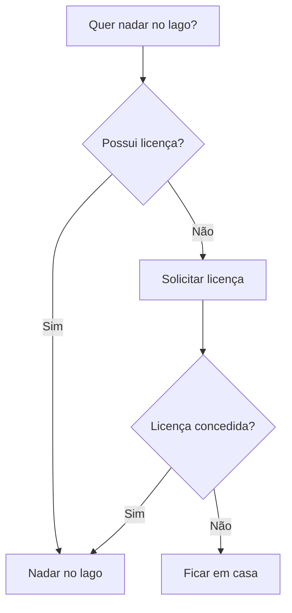
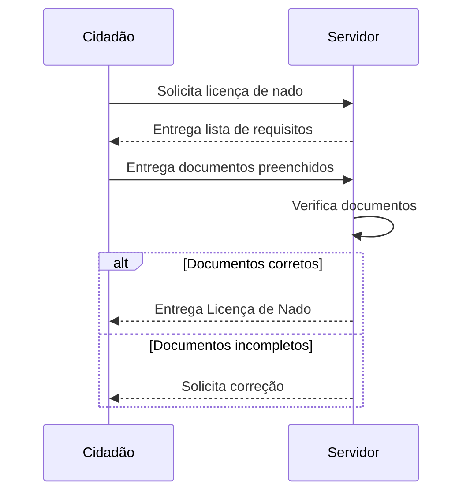

## Explicação
### Por quê
Tornar ideias, estruturas e processos mais compreensíveis por meio de visualização clara, rápida e acessível. Diagramas ajudam a alinhar equipes, reduzir ambiguidade e documentar conhecimento de forma colaborativa, mesmo em contextos dinâmicos.
### Como
Escreve-se um código de marcação simples, que descreve graficamente a lógica ou sequência desejada. Esse código é renderizado automaticamente como um diagrama visual, sem necessidade de ferramentas gráficas. Pode ser usado em ambientes como Markdown, Obsidian, Notion ou páginas estáticas com Quartz.
### O quê
É uma linguagem declarativa de geração de diagramas, que permite criar representações visuais como fluxogramas, jornadas de usuário, linhas do tempo, organogramas, entre outros. Funciona a partir de texto e é ideal para contextos de design, documentação e inovação.
## Exemplos
### Fluxograma

### Diagrama de sequência

### Gráfico Gantt

```mermaid
gantt
    title Rotina diária do servidor no posto de licenças
    dateFormat  HH:mm
    axisFormat  %H:%M
    section Manhã
    Abrir o posto        :done, t1, 07:00, 30m
    Atender cidadãos     :active, t2, 07:30, 3h
    Pausa para descanso  :         t3, 10:30, 30m
    Retomar atendimento  :         t4, 11:00, 2h

```

