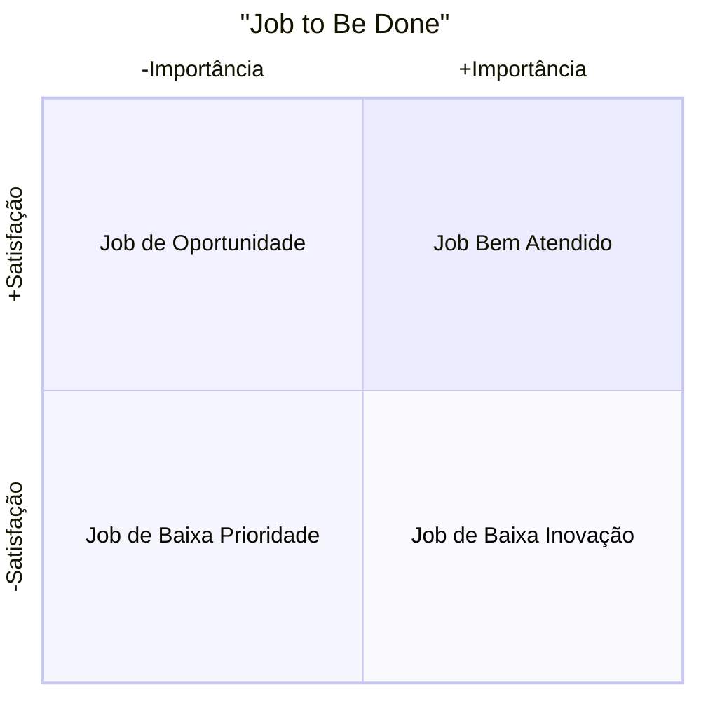

## Explicação
### Por quê
Identificar e priorizar as tarefas (jobs) que os clientes realmente querem realizar — tanto funcionais quanto emocionais — para orientar inovação e garantir que sua solução entregue valor onde há maior oportunidade.
### Como
1. **Liste todos os jobs** que seus clientes podem executar (entrevistas, pesquisas, workshops).
    
2. **Avalie cada job** segundo dois critérios-chave:
    
    - **Importância**: quão crítico é esse job para o usuário?
        
    - **Satisfação Atual**: quão bem as soluções existentes atendem a esse job?
        
3. **Classifique** os jobs em uma matriz de quadrantes cruzando Importância × Satisfação.
    
4. **Priorize** os jobs no quadrante de Alta Importância e Baixa Satisfação para inovação e desenvolvimento.
    
### O quê
Framework de segmentação de “jobs” que ajuda a visualizar onde existem lacunas de mercado, entendendo quais tarefas são urgentes e mal atendidas versus aquelas que já estão bem resolvidas.

## Diagrama

