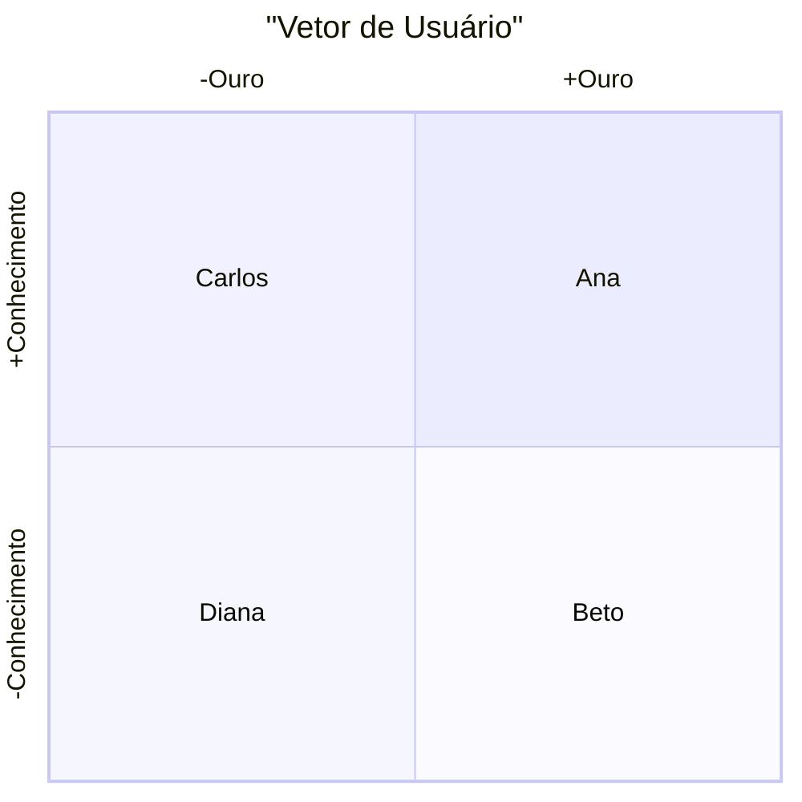

## Explicação
### Por quê
Classificar usuários de forma estratégica ajuda a entender segmentos com perfis distintos, orientar priorização de esforços e personalizar soluções.
### Como
1. **Defina dois eixos** relevantes ao seu produto ou serviço (por exemplo: investimento financeiro “Ouro” vs. nível de conhecimento).
    
2. **Crie quadrantes** cruzando as polaridades de cada eixo (–Ouro / +Ouro e –Conhecimento / +Conhecimento).
    
3. **Mapeie perfis** nomeados e caracterizados em cada quadrante, usando pesquisas, entrevistas e dados de uso.
    
4. **Use essa matriz** para priorizar funcionalidades, campanhas de comunicação e estratégias de engajamento por perfil.
    
### O quê
Ferramenta de segmentação visual — um diagrama de quadrantes — que posiciona perfis de usuários conforme dois critérios-chave, facilitando decisões de design e marketing.

## Diagrama

Consulte [[Atributos das personas]]